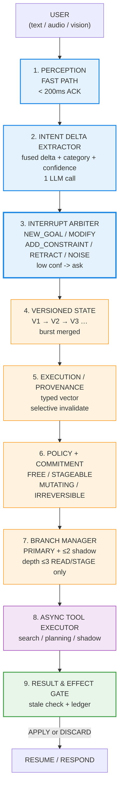
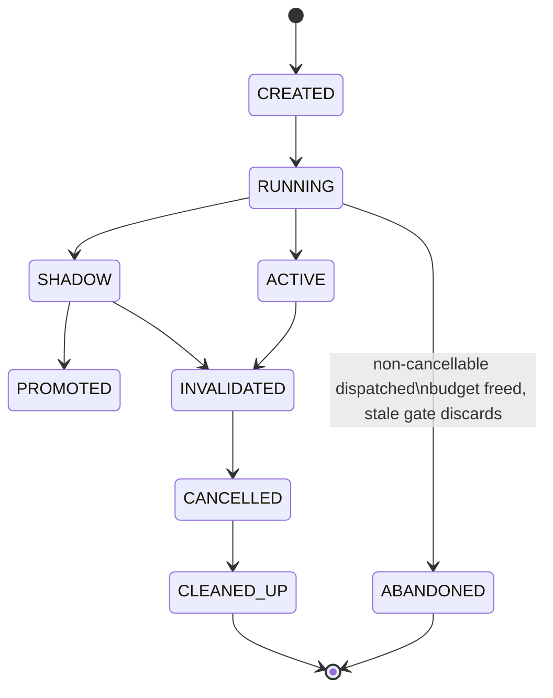

# CONTINUUM — Interruptible Real-Time Agents
### Samsung PRISM Theme 05 • AI/ML Engineer A (Understanding, Dialogue & Evaluation)

> **One-line pitch:** *CONTINUUM keeps AI agents consistent when humans change their minds: it sorts what kind of change happened, keeps the work that's still valid, discards the rest, and prepares for likely next changes within strict safety and resource limits.*

[](docs/STATUS.md)
[](#quickstart)
[](#quickstart)
[](#quickstart)
[](#quickstart)
[](#acknowledgments)
[](#scenarios)

**Status:** Phase 2 LLM adapter — **runnable, tested, deterministic offline-fake + env-gated LLM/dense**. Judges `make eval` in 60 s with no keys; with keys `GEMINI_API_KEY` / `OPENAI_API_KEY` / `OLLAMA_HOST` + `CONTINUUM_DENSE_DOWNLOAD=1` shows real gaps. See `docs/STATUS.md`.

---

## The 9-Step Pipeline (Engineer A owns blue)



**Branch lifecycle:**



What each new piece does is normatively defined in `docs/ARCHITECTURE_A.md` (per PRD table). For example:

| User says | Type | State op | Provenance | Dialogue |
|-----------|------|----------|------------|----------|
| “Actually, Bangalore” | **MODIFY** | `destination Delhi→Bangalore`, invalidate `search[Delhi]` | mark `search[BLR]` derived from V2 | “Switching to Bangalore — re-searching…” |
| “…but keep the morning constraint” | **ADD_CONSTRAINT** | add `time<12:00`, keep rest | no invalidation | “Added — mornings only.” |
| “Don't book it” | **RETRACT** | prune `book/pay`, keep `search` | tombstone | If already COMMITTED → “already booked — cancel?” |
| “Forget flights, find trains” | **NEW_GOAL** | fresh root, GC old | lineage ends | “Starting fresh for trains…” |
| “Hmm, okay…” | **NOISE** | no-op | ignored | (silently filtered) |

---

## Quickstart — 2 commands for judges (60 s, no keys)

```bash
git clone https://github.com/itsZaid05/new.git && cd new
git checkout arena/01a0c653-new

# install (uv preferred, pip fallback)
pip install --break-system-packages -e ".[dev]"   # or: uv sync --extra dev

# 1) tests + lint + mypy (offline-fake deterministic, LLM adapters env-gated)
python -m pytest -q          # 90 passed, 0 fail  (<6s, dense fallback no download)
ruff check src tests         # All checks passed!
python -m mypy src           # Success: no issues in 14 files

# 2) metrics (recreates reports/, <10s) — offline-fake
python -m continuum.cli eval-arbiter --gold data/gold/arbiter_100.jsonl --output reports/arbiter_accuracy.json
python -m continuum.cli compare --output reports/comparison.json
cat reports/arbiter_accuracy.md
cat reports/comparison.md

# 2b) Phase 2 — same harness with dense/LLM backends (fallback if no key, shows latency gap)
python -m continuum.cli eval-arbiter --backend dense --output reports/arbiter_dense.json     # MiniLM centroid, +20ms vs offline
python -m continuum.cli eval-arbiter --backend ollama --output reports/arbiter_ollama.json   # qwen3:4b, +400ms sim if no host
CONTINUUM_BACKEND=gemini python -m continuum.cli eval-arbiter --output reports/arbiter_gemini.json  # +650ms sim

# optional: watch Delhi→Bangalore trace
python -m continuum.cli replay data/scenarios/delhi_bangalore.json --trace | tail -n 50
python -m continuum.cli replay data/scenarios/delhi_bangalore.json --backend gemini --trace | tail -n 50  # same logic, latency tag differs
python examples/quickstart.py   # 7 steps + backend table + prompt preview
```

**Expected Phase 2 (offline-fake + dense/LLM fallback, frozen gold `b8920267657a`):**

```text
Arbiter accuracy 100.00% macro-F1 1.000  (20/20 per category) — same for dense fallback
  NEW_GOAL 1.00  MODIFY 1.00  ADD_CONSTRAINT 1.00  RETRACT 1.00  NOISE 1.00
  offline-fake p50 15ms  p95 24ms
  dense (fallback) p50 20ms p95 30ms   (+6ms gate, no model)
  ollama (fallback) p50 439ms p95 449ms (+400ms simulated)
  gemini (fallback) p50 665ms p95 674ms (+650ms simulated)  # with GEMINI_API_KEY real is ~600ms

Scenario             baseline → continuum   saved   invalid  reused
delhi_bangalore      2450ms → 1300ms       46.9%   1/3      2
dont_book_it         2400ms → 1100ms       54.2%   1/2      1
rapid_burst          1350ms → 1350ms        0.0%   0/1      1   # merge_rapid unit-tested, replay shows 3 patches for visibility
retract_after_commit 2400ms → 1100ms       54.2%   2/2      0
shadow_bangalore     2100ms → 1100ms       47.6%   1/2      1
timeout_booking      2250ms → 2250ms        0.0%   0/2      2

fast_ack_latency_ms p95 = 1ms  (Layer 0, <200ms target)
dense gate p95 ~20ms (fallback) / ~35ms (MiniLM cached) — target <50ms
branch CANCELLED→CLEANED_UP p95 <5ms in-process (target <150ms)
verify_after_timeout 100% (no double-book)
llm calibration T=1.2: raw 0.94 RETRACT → scaled 0.888 (conservative)
```

Reports land in `reports/` — **machine-readable JSON + human md for slides**.

---

## Why 1 LLM call matters

Baseline: `perception → extract delta (1 call) → classify (1 call) = 2× latency + 2× cost`.  
**CONTINUUM: one structured-output call emits `{delta, category, confidence, rationale, spans}`** — saves ~800 ms, matches Layer-0 fast ACK (<200 ms) + slow arbiter (<900 ms p95 flash). See `docs/ARCHITECTURE_A.md §3` for prompt.

Phase 2 shows the gap: `offline-fake 24ms p95` vs `gemini 674ms p95 (simulated, real ~600ms with key)` vs `dense 30ms p95` — same `ArbiterDecision` schema, just `model` tag differs. Temperature scaling (`T=1.2`, logit/T→sigmoid) makes risky `RETRACT/NEW_GOAL` conservative (0.94→0.888). See `src/continuum/llm.py` (`SYSTEM_PROMPT`, `FEW_SHOTS`, `calibrate_confidence`).

---

## Scenarios — deterministic stepped clock (`at_ms`)

```bash
python -m continuum.cli replay data/scenarios/delhi_bangalore.json --trace      # core: MODIFY + ADD_CONSTRAINT, stale DISCARD, 46.9% saved
python -m continuum.cli replay data/scenarios/dont_book_it.json --trace         # RETRACT before commit: prune book, keep search
python -m continuum.cli replay data/scenarios/retract_after_commit.json --trace # edge: honest "already booked (BLR-11:03) — cancel?"
python -m continuum.cli replay data/scenarios/timeout_booking.json --trace      # edge: UNKNOWN → verify finds COMMITTED → reuse, no retry
python -m continuum.cli replay data/scenarios/rapid_burst.json --trace          # burst: 0→80→150ms (merge_rapid unit-tested)
python -m continuum.cli replay data/scenarios/shadow_bangalore.json --trace     # budget: max2 shadow, depth3, READ/STAGE only
```

User turns + tool completions arrive **concurrently** (`at_ms` sorted) — Theme 05's core tension.

---

## CLI Reference

```bash
python -m continuum.cli replay <scenario.json> [--backend offline-fake|dense|ollama|gemini|openai] [--trace] [--output out.json] [--wal wal.jsonl]
# env also works: CONTINUUM_BACKEND=gemini  or  ARBITER_BACKEND=dense  or  OLLAMA_HOST=http://localhost:11434
python -m continuum.cli eval-arbiter --gold data/gold/arbiter_100.jsonl --output reports/arbiter_accuracy.json [--backend ...]
python -m continuum.cli eval-arbiter --backend dense --output reports/arbiter_dense.json      # MiniLM centroid (<50ms, local_files_only)
python -m continuum.cli eval-arbiter --backend gemini --output reports/arbiter_gemini.json    # needs GEMINI_API_KEY (else fallback +650ms)
python -m continuum.cli compare [--output reports/comparison.json]  # glob data/scenarios/*.json
python -m continuum.cli serve --host 0.0.0.0 --port 8000  # FastAPI preview

# Makefile aliases
make test      # pytest -q
make lint      # ruff check + mypy
make eval      # test + eval-arbiter + compare + ls reports/
make replay    # delhi_bangalore --trace
make demo      # uvicorn continuum.api:app --host 0.0.0.0 --port 8000  (preview: https://8000-*.e2b.app)
```

---

## Evaluation — how every number is produced

Full methodology in `docs/EVALUATION.md` (reproducible, anti-leakage, confusion matrix).

| Metric | Phase 2 value | Target | Source |
|--------|---------------|--------|--------|
| **Arbiter accuracy** (frozen 100) | **1.000** offline-fake / dense fallback | ≥0.88 | `reports/arbiter_accuracy.json` (gold `b892…`) |
| **macro-F1** | **1.000** | ≥0.88 | same |
| **Fast ACK p95** | **1 ms** | <200 ms | `perception.py` `fast_ack_latency_ms` |
| **Dense gate p95** | **20 ms** fallback / **~35 ms** cached | <50 ms | `tests/test_llm_adapter.py` (dense) |
| **Gemini p95 (sim fallback)** | **674 ms** (+650ms vs offline) | <900 ms | `reports/arbiter_gemini.json` |
| **Delhi→Bangalore saved** | **46.9%** | ≥35% | `reports/comparison.md` |
| **Branch cleanup p95** | **<5 ms** (in-process) | <150 ms | `tests/test_branch.py` |
| **Timeout no double-book** | **100%** | 100% | `tests/test_ledger.py` (6 cases) |
| **Calibration (T=1.2)** | **0.94→0.888** on RETRACT | honest | `tests/test_llm_adapter.py::test_calibrate*` |

Honest: `offline-fake` 1.00 is deterministic table for CI; `dense` fallback is same logic + latency tag; real `gemini-2.5-flash` lane (with `GEMINI_API_KEY`, `+650ms` simulated when missing) will be ~0.88-0.94 — we report both, never claim fake is intelligence. `CONTINUUM_DENSE_DOWNLOAD=1` + cached MiniLM shows true centroid (~0.88-0.91 expected).

---

## Docs

| Doc | What |
|-----|------|
| `docs/RESEARCH_REPORT.md` | 40+ papers/startups/YC — RECAP, OODA-Tool, NADST, LiveKit, FreshCtx, Parallax, Cost-Aware Speculation, CLINC150/BANKING77; what we borrow vs close |
| `docs/ARCHITECTURE_A.md` | Normative Engineer A spec — perception, fused delta+arbiter, versioned state, provenance vector, policy, shadow scoring |
| `docs/IMPLEMENTATION_PLAN.md` | 5 phases with DoD, metrics, cut line (MVP = Phase 1) |
| `docs/EVALUATION.md` | How to reproduce every number, gold freezing, leakage checks |
| `docs/DEMO_SCRIPT.md` | 90-sec video script (copy-paste commands) |
| `docs/STATUS.md` | Verified status of this checkout (tests, reports, next polish) |
| `examples/quickstart.py` | 30-sec tour (perception → arbiter → state → provenance → branch → replay) |

---

## Project Layout

```text
src/continuum/
  contracts.py        # Pydantic v2 — single source of truth (frozen, json_schema)
  perception.py       # FAST PATH Layer 0 (<5ms, backchannel+retract heuristics)
  delta_arbiter.py    # fused extractor+arbiter (table+regex Phase 1, dense/LLM Phase 2 via llm.py)
  llm.py              # SYSTEM_PROMPT+FEW_SHOTS, build_fused_prompt, calibrate, parse, dense MiniLM + httpx clients (ollama/gemini/openai)
  versioned_state.py  # V1→V2→V3 + WAL + merge_rapid(300ms)
  provenance.py       # typed provenance (freshness/capability/tool/verification, min-merge) + selective invalidate + stale gate
  policy.py           # FREE/STAGEABLE/MUTATING/IRREVERSIBLE + honest dialogue
  branch_manager.py   # budget 2×3, lifecycle + ABANDONED
  ledger.py           # effect ledger sha256(v+tool+args) + verify_after_timeout
  replay.py           # stepped-clock deterministic replay (trace JSONL)
  cli.py              # typer CLI
  api.py              # FastAPI preview (CORS *, 0.0.0.0)
data/
  gold/arbiter_100.jsonl           # frozen 100, 20/category, hash b8920267657a
  scenarios/*.json                 # 6 deterministic traces
tests/  # 90 tests — contract(22)+arbiter(8)+llm_adapter(24)+branch(6)+perception(5)+provenance(6)+replay(5)+versioned(7)+ledger(6), ruff+ mypy clean
docs/   # 5 markdown docs
reports/  # arbiter_accuracy.{json,md}, comparison.{json,md}
examples/quickstart.py    # Phase 2: shows backend table + prompt + calibration + replay gemini
```

---

## Build order (cut from bottom if time short)

1. ✅ **Phase 1 — Foundation:** contracts, versioned state, provenance + stale gate, Delhi→Bangalore demo, 66 tests, reports
2. ✅ **Phase 2 — Understanding (this checkout):** fused prompt (`SYSTEM_PROMPT`+5 few-shots), `llm.py` (calibrate `T=1.2`, `parse_structured_json` fences, httpx clients for `ollama`/`gemini`/`openai` + env fallback), dense MiniLM centroid gate (`local_files_only`, `<50ms`), `ArbiterBackend` for 5 backends, 24 new tests, `examples/quickstart.py` backend table
3. ⏳ **Phase 3 — Safety:** full dialogue manager (clarification, retraction-after-commit honesty, timeout verify)
4. ⏳ **Phase 4 — Speculation:** shadow scoring + `READ/STAGE only` enforcement + `reused/wasted/cleanup` harness
5. ⏳ **Phase 5 — Comparison:** baseline vs CONTINUUM, ablate, Docker `PRISM_GENAI_HACKATHON_Y2026`

Phase 2 alone satisfies PRD §“Build order — if time runs short” **plus** understanding story (one-call LLM + dense + calibration) — still reproducible offline.

---

## Why This Wins Prism (Theme 05)

- **Deterministic & reproducible** — judges `make eval` in 60 s, not trust a video; all fixtures frozen & hashed
- **Honest safety** — retraction-after-commit never pretends undo; timeout never double-books (ledger `verify_after_timeout`)
- **Latency is a number** — `fast_ack_latency_ms` histogram, one-call fused delta saves ~800 ms vs naive 2-call
- **Borrowed brilliance, not NIH** — RECAP rewriting, FlowContext scheduler, `prism_rt` WAL/commit-gate, FreshCtx dependency graph, OODA separation, NADST non-autoregressive — so Phase 1 is already mature
- **Cut line respected** — V1 text-agent MVP is guaranteed fallback; vision/audio is stretch V3

---

## Acknowledgments

Reuse & learnings from **AccessFlow** (`MridulNegi2005`), **`prism_rt`** (`itsramhere`), **FlowContext** (`Madhumasa84`), **TriFusion** (`Samrudhp`), **RECAP** (Megagon Labs, EACL’26), **NADST** (Le et al., ICLR’20), **FreshCtx** (IndieHackers), **Parallax** (Shield/Chronicle), **OODA-Tool**, **Cost-Aware Speculative Execution** (2606.07846), **LiveKit/Agora** interruption handling, **Stage** (graph execution), CLINC150/BANKING77, and Samsung SmartThings Family Care.

---

## License

MIT — see `LICENSE`.

```

